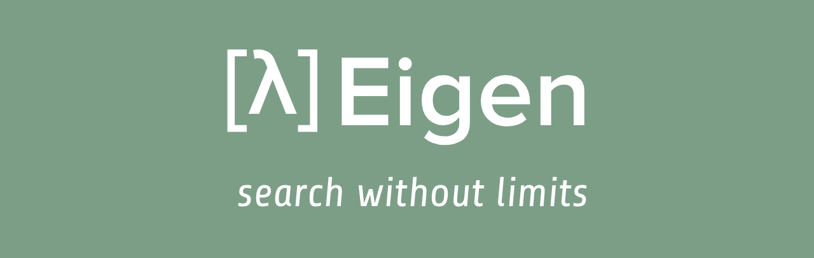

    

An educational platform for semantic document search. Upload your files, and Eigen will chunk, embed, and index them so you can search across all your content using natural language.

**Team:** Russel, Dinu, Samarvir, Harshit

## What It Does

- **Upload documents** — Supports PDF, TXT, EPUB, and MP4 files (video is transcribed via Whisper). Drag and drop files up to 100 MB.
- **Chunking & embedding** — Files are parsed, split into overlapping chunks to preserve context, and embedded using OpenAI. Chunks retain source metadata like page numbers, chapters, and timestamps.
- **Semantic search** — Search across all your documents with natural language queries. Results are ranked by relevance and link back to the exact location in the source file.
- **Document viewer** — Read PDFs and text files directly in the app with zoom, rotation, and annotation tools (highlights and notes).

## Tech Stack

- **Backend:** Python, FastAPI, SQLAlchemy, OpenAI embeddings, Moorcheh vector database
- **Frontend:** React, TypeScript, Tailwind CSS, Vite
